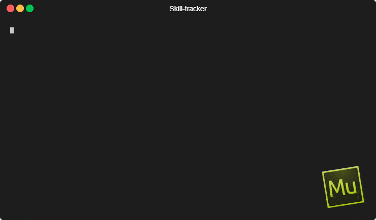

# net.avdw.skill-tracker


_Player skill tracker for competitive games_

Featuring: 
- **player leaderboards** for bragging rights
- **team suggestions** for quality matches
- **commandline interface** for personal use
- **discord interface** when sharing with friends

## Showcase



## Table of contents

1. [Getting started](#getting-started)
2. [Usage](#usage)
3. [Configuration](#configuration)
4. [Support](#support)
5. [Changelog](#changelog)
6. [Roadmap](#roadmap)
7. [Contributing](#contributing)
8. [License](#license)

## Getting started

> See the [support](#support) section to setup your environment to build the project.

The below snippet will download the source and build it.
```shell script
$ git clone https://github.com/avanderw/skill-tracker.git
$ cd skill-tracker/
$ mvn verify
```

Alternatively you can download and unzip the binary. 
> NOTE: the java commands will change from `java -jar ./target/skill-tracker.jar` to 
> `java -jar skill-tracker.jar`

### Command-line
> This program is primarily written as a command line application. 

See the [usage](#usage) section to learn more about the different commands.
Below is the output of a successful setup.

```shell script
$ java -jar ./target/skill-tracker.jar --help
Usage: skill-tracker [-hV] [COMMAND]
Player skill tracker for competitive games
  -h, --help      Show this help message and exit.
  -V, --version   Print version information and exit.
Commands:
  game    Manage game information
  match   Manage matches and outcomes
  player  Manage players
```

### Discord
> The discord bot is intended as a quick way to share the program with friends. 
> Every server the bot is included on will share the same database. 
> This is not intended for general public consumption.

See the [configuration](#configuration) section to learn how to setup your api-token.
The default prefix for the bot is `--` and replaces `java -jar ./target/skill-tracker.jar`.
The below output is from the bot connecting successfully. 

```shell script
$ echo "api-token=<your-discord-api-token>" > ./discord.properties
$ java -cp ./target/skill-tracker.jar net.avdw.skilltracker.discord.DiscordDaemon
Discord bot is ready
  (see ./skill-tracker.log for further details)
  (press <Ctrl+C> to stop)
```

The bot can now be invited to your discord server. The invite URL will be found on your 
[discord application](https://discord.com/developers/applications/) dashboard under the OAuth2 section. 

## Usage

### Register a game
> A game must be registered to play matches against. This is a design choice as it prevents costly mistakes when adding a match.

The only optional argument is the draw probability of a match in the game. 
For example in chess it would be high; whereas in tennis it would be low. The default draw probability is 10%.
Due to complications in the math (divide by zero), a game may not have 0% draw probability.    
```shell script
$ java -jar ./target/skill-tracker.jar game add Naruto
Successfully added the game
  (use `match add --help` to add a match)
```

### Add a match
> A player is not required when adding a match. They will automatically be created.
> Spelling mistakes create new players. Use 'match rm' to remove bad matches and 'player mv' to fix spelling mistakes.

The most common command to follow `match add ...` is `game view ...`. Thus the two commands were chained together.
```shell script
$ java -jar ./target/skill-tracker.jar match add Naruto Sasuke,Orochimaru,Nagato Kabuto,Gaara -r=1,2,3 -g=Naruto
Successfully created match
> 2020-07-09 Naruto #1:Naruto vs. #2:Sasuke & Nagato & Orochimaru vs. #3:Gaara & Kabuto (5401c3fd)
...
```

### View game leaderboard

> The leaderboard is ordered by the conservative rating = (μ) - 3(σ). 
> Thus the leaderboard is 99% certain you are better than your ranking.

Each game keeps track of it's own leaderboard. The data is statically cached in the database.
The data is recalculated when matches are removed. It caters for duplicate players. This is useful when playing bots of the same type.
The outcome of all the duplicates in the match are averaged together to form the new (μ) and (σ).

```shell script
$ java -jar ./target/skill-tracker.jar game view Naruto
Top 10 players:
>  1: (μ)=36 (σ)=4 Asuma
>  2: (μ)=20 (σ)=3 Akamaru
>  3: (μ)=19 (σ)=3 Kankuro
>  4: (μ)=20 (σ)=3 Kakashi
>  5: (μ)=17 (σ)=3 Naruto
>  6: (μ)=18 (σ)=3 Haku
>  7: (μ)=19 (σ)=4 Sasori
>  8: (μ)=17 (σ)=3 Kisame
>  9: (μ)=16 (σ)=3 Hinata
> 10: (μ)=15 (σ)=3 Kakuzu

Showing the last 5 matches:
> 2020-07-09 (5401c3fd) #1:Naruto vs. #2:Sasuke & Nagato & Orochimaru vs. #3:Gaara & Kabuto
> 2020-07-09 (3dc08968) #2:Sasori & Sakura & Sasuke vs. #1:Kakuzu & Zetsu
> 2020-07-09 (990aa03d) #2:Kakuzu & Kakashi vs. #1:Madara & Ino & Choji
> 2020-07-09 (7a5d8c21) #1:Deidara & Kakuzu & Asuma vs. #3:Kisame vs. #2:Zetsu & Madara
> 2020-07-09 (32577596) #2:Madara & Zetsu vs. #1:Sasori & Sakura
```

### Suggest team setup

> Higher quality matches will have a more fair game. 
> The quality will be better represented the lower the (σ) of the players.
> The (σ) will lower faster the more 1v1 a player plays

The team suggest option will suggest games that are of high quality. The higher the quality the closer the skills are matched.
It is obvious who the winner will be with a 0% quality and anybodies guess with 100% quality. Any team combination can be used.
The only rule is that the number of players in all the teams add up to the number of players provided. 

```shell script
$ java -jar ./target/skill-tracker.jar match suggest 2v2v1 Naruto,Sasuke,Madara,Nagato,Kakashi -g=Naruto
Suggest team setups for Naruto
> (μ)=17 (σ)=3   Naruto
> (μ)= 7 (σ)=2   Sasuke
> (μ)=12 (σ)=3   Madara
> (μ)=10 (σ)=3   Nagato
> (μ)=20 (σ)=3   Kakashi

Quality          Setup
61%     (Naruto, Sasuke) vs. (Madara, Nagato) vs. (Kakashi)
46%     (Naruto, Nagato) vs. (Sasuke, Madara) vs. (Kakashi)
35%     (Nagato, Madara) vs. (Sasuke, Kakashi) vs. (Naruto)
31%     (Naruto, Madara) vs. (Nagato, Sasuke) vs. (Kakashi)
23%     (Nagato, Kakashi) vs. (Madara, Sasuke) vs. (Naruto)
14%     (Kakashi, Madara) vs. (Nagato, Sasuke) vs. (Naruto)
8%      (Naruto, Nagato) vs. (Sasuke, Kakashi) vs. (Madara)
7%      (Naruto, Sasuke) vs. (Kakashi, Nagato) vs. (Madara)
3%      (Naruto, Madara) vs. (Kakashi, Sasuke) vs. (Nagato)
2%      (Naruto, Sasuke) vs. (Madara, Kakashi) vs. (Nagato)
1%      (Kakashi, Naruto) vs. (Sasuke, Nagato) vs. (Madara)
1%      (Naruto, Kakashi) vs. (Sasuke, Madara) vs. (Nagato)
0%      (Nagato, Kakashi) vs. (Naruto, Madara) vs. (Sasuke)
0%      (Nagato, Naruto) vs. (Madara, Kakashi) vs. (Sasuke)
0%      (Kakashi, Naruto) vs. (Nagato, Madara) vs. (Sasuke)
```

## Configuration
### Skill tracker
_./skilltracker.properties_
```properties
net.avdw.skilltracker.JDBC_URL=jdbc:sqlite:skill-tracker.sqlite
```

### Discord
> You must have an existing [discord application](https://discord.com/developers/applications/) to be able to continue.

You will need to replace _\<your-discord-api-token\>_ with your client secret found under general information.

_./discord.properties_
```properties
net.avdw.skilltracker.discord.API_TOKEN=<your-discord-api-token>
net.avdw.skilltracker.discord.PREFIX=--
```

### Logging
_./tinylog.properties_
```properties
writer        = file
writer.file   = skill-tracker.log
writer.level  = info
writer.format = [{level}] at .({class-name}.java:{line}) {message}
```
Further documentation can be found at [tinylog.org](https://tinylog.org/v2/configuration/)

## Support

### Installing supporting software
> It is recommended to make use of a package manager to simplify the setup of your environment

- Git
- Java (_built with JDK14_)
- Maven

#### Chocolatey (https://chocolatey.org/install)
```cmd
$ choco install git
$ choco install ojdkbuild
$ choco install maven 
```

## Changelog


All notable changes to this project will be documented in [CHANGELOG](CHANGELOG.md). 
The format is based on [Keep a Changelog](https://keepachangelog.com/en/1.0.0/) 
and adheres to [Semantic Versioning](https://semver.org/spec/v2.0.0.html).

## Roadmap
Refer to the file [.todo/todo.txt](.todo/todo.txt) for a list of potential future work.
Here is a [complete primer](https://github.com/todotxt/todo.txt) on the whys and hows of todo.txt.

## Contributing


We love contributions! Please read [CONTRIBUTING](CONTRIBUTING.md) for details on how to contribute.

## License 
This project is licensed under the GNU General Public License v3.0 - see the [LICENSE](LICENSE) file for details
